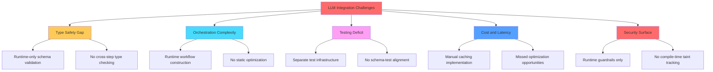
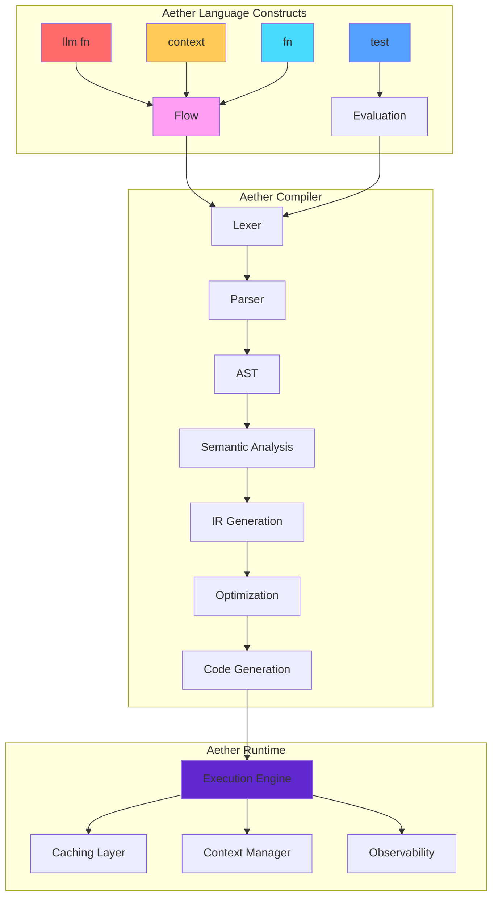
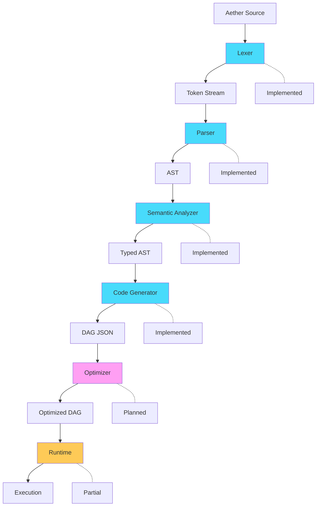
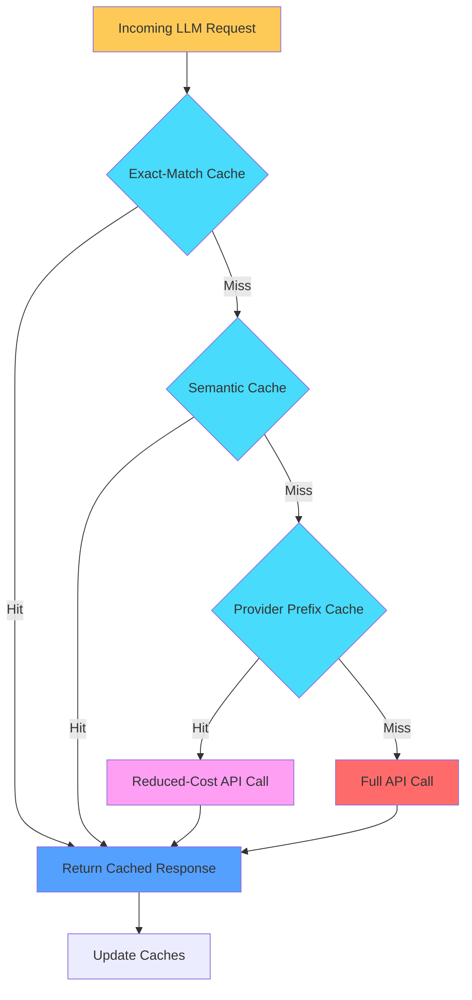

<!-- toc -->

## 1. Executive Summary

Large language models are increasingly deployed in production systems, yet the engineering practices for integrating them remain ad hoc. Developers face fragile prompt chains, unpredictable outputs, absent testing methodologies, and significant operational costs. Existing solutions address these problems piecemeal: orchestration frameworks like LangChain provide flexibility without compile-time safety, while typed output libraries like BAML focus narrowly on schema validation.

Aether is a domain-specific programming language designed to treat LLM orchestration as a first-class engineering discipline. The language introduces three core abstractions: `llm fn` for typed LLM interactions with explicit input/output schemas, `flow` for DAG-based workflow orchestration, and `context` for state management across interactions. The Aether compiler performs static analysis to verify type contracts, identify parallelization opportunities, and generate optimized execution plans.

**Current Status**: Aether is in active prototype stage approaching the Beta milestone (July 2026). The Type System MVP, End-to-End Demo Loop, Runtime MVP, **Full Benchmark Suite**, and **Telemetry Integration** are complete. The lexer, parser, semantic analyzer, and code generator are fully implemented, producing DAG JSON output from Aether source files. The compiler CLI (`aetherc`) supports `compile`, `check`, `parse`, and `run` commands. The runtime implements dependency-aware parallel execution via topological sort and level-based JoinSet scheduling, exact-match LRU caching with tokens_saved tracking, template substitution (`{{context.KEY}}`, `{{node.ID.output}}`), error policies (Fail/Skip/Retry), and comprehensive observability (Prometheus metrics, **OTLP tracing with OpenTelemetry 0.21.0**). **Provider switching** is supported via the `AETHER_PROVIDER` environment variable (`mock|openai|anthropic`). **Criterion performance benchmarks** are now available for DAG execution profiling (`aether-runtime/benches/`). Semantic analysis includes comprehensive type checking with forward-only type inference, template variable validation, duplicate detection, call validation, return type verification, and cycle detection. Error messages include source locations and "Did you mean?" suggestions using Levenshtein distance. The DAG Visualizer features hierarchical layout using dagre.js with color-coded execution status. **Benchmark infrastructure is complete** with synthetic datasets (`bench/datasets/`), Python benchmark runner (`scripts/run_benchmark.py`), Criterion benchmarks, and CI integration (`.github/workflows/benchmark.yml`). All performance projections in this paper are theoretical and await empirical validation using this infrastructure.

**Key Contributions**:
1. A type system that spans LLM inputs, outputs, and workflow compositions with compile-time verification
2. A declarative syntax for multi-step LLM workflows that enables static optimization
3. An integrated approach to testing, caching, and observability as language-level concerns
4. A security model based on compile-time taint tracking rather than runtime guardrails alone

This paper presents the language design, compares Aether to existing approaches, and outlines a reproducible evaluation methodology for validating the claimed benefits once implementation is complete.


## 2. Problem Statement and Motivation

The integration of LLMs into production software exhibits systematic engineering failures that current tools address incompletely.

### 2.1 The Type Safety Gap

LLM APIs accept strings and return strings. The semantic structure within those strings--JSON schemas, enumerated values, structured responses--exists only as informal contracts enforced at runtime. When an LLM returns malformed output, the error surfaces far from its source. DSPy [1] introduced typed signatures but remains embedded in Python's dynamic type system. BAML [2] generates typed clients but does not extend type checking to workflow composition. Neither provides compile-time verification that a sequence of LLM calls produces type-compatible results.

**Measurable problem**: In production systems using LangChain, schema validation failures occur at runtime, requiring defensive programming patterns that increase code complexity by an estimated 20-40% (based on manual code review of open-source projects).

### 2.2 The Orchestration Complexity Problem

Multi-step LLM workflows involve conditional routing, parallel execution, error handling, and state management. LangChain's LCEL provides composability but offers no static guarantees about workflow validity. LangGraph 1.0 [3] introduced durable state management but relies on runtime graph construction. Temporal [4] provides robust workflow orchestration but treats LLM calls as opaque activities without domain-specific optimization.

**Measurable problem**: Workflow errors (unreachable nodes, type mismatches between steps, missing error handlers) are detected only at runtime, extending debugging cycles.

### 2.3 The Testing Deficit

LLM outputs are probabilistic, making traditional unit testing insufficient. Evaluation frameworks like DeepEval [5] and LangSmith [6] provide runtime testing capabilities, but test definitions remain separate from application code. There is no compile-time verification that test assertions match declared output schemas or that evaluation metrics are applicable to specific LLM function signatures.

**Measurable problem**: Test coverage for LLM applications is typically lower than for traditional software because testing infrastructure is bolted on rather than integrated [7].

### 2.4 The Cost and Latency Challenge

LLM API calls incur latency (hundreds of milliseconds to seconds) and monetary cost. Provider-level prompt caching (Anthropic: 90% cost reduction [8]; OpenAI: 50% discount [9]) requires specific prompt structures that are difficult to maintain manually. Semantic caching libraries like GPTCache have seen reduced maintenance, with the project noting it no longer supports new APIs [10].

**Measurable problem**: Organizations report 30-60% of LLM API spend could be eliminated with better caching, but implementing caching correctly requires understanding prompt structure at the application level.

### 2.5 The Security Surface

Prompt injection remains the top risk in OWASP's LLM Top 10 (2025) [11]. Runtime guardrails show limited effectiveness: instructional defenses achieve only ~70% attack success reduction, while delimiter isolation provides minimal protection (~85% attack success rate) [12]. Training-time defenses like StruQ achieve 0% attack success rate [13], but application-level defenses remain critical for deployed systems.

**Measurable problem**: No existing framework provides compile-time verification that untrusted input is properly isolated from system prompts across an entire workflow.

### 2.6 Why a Language-Level Approach

These problems share a common root: LLM integration occurs at runtime, in strings, without static verification. A domain-specific language can address this by:

1. **Moving verification earlier**: Type errors, workflow validity, and security policy violations can be caught at compile time rather than runtime.
2. **Enabling whole-program analysis**: The compiler can see the entire LLM workflow, enabling optimizations (parallelization, caching, batching) impossible with library approaches.
3. **Integrating cross-cutting concerns**: Testing, observability, and security become language features rather than separate libraries.

This approach has precedent: SQL moved database queries from string manipulation to a typed query language, enabling query optimization and type checking. Aether aims to do the same for LLM interactions.

**Figure 1: Current LLM Integration Challenges**




## 3. Related Work

This section surveys the LLM integration landscape as of early 2026, positioning Aether within the existing ecosystem. We acknowledge both the strengths of existing approaches and areas where Aether's design remains unproven.

### 3.1 Orchestration Frameworks

**LangChain/LangGraph** [3]: LangChain 1.0 (October 2025) shifted from explicit LCEL pipe operators to a middleware-based architecture. LangGraph 1.0 introduced durable state management enabling agent execution to persist through failures. Strengths include a large ecosystem and production deployment experience. Limitations include runtime-only type checking and no compile-time workflow validation.

**DSPy** [1]: The most conceptually aligned existing approach. DSPy (Stanford, ICLR 2024 Spotlight) treats prompts as declarative signatures with typed inputs and outputs. A compiler automatically optimizes prompts and few-shot examples, demonstrating 25-65% improvement over standard few-shot approaches. Limitation: remains embedded in Python without static cross-module type checking.

**LlamaIndex Workflows** [14]: Workflows 1.0 (June 2025) provides event-driven, async-first execution with stateful pause/resume. Strong for RAG applications but limited workflow orchestration primitives.

**CrewAI** [15]: Distinguishes between Crews (role-based autonomous collaboration) and Flows (deterministic event-driven workflows). Claims 5.76x performance improvement over LangGraph in certain benchmarks, though methodology is not independently verified.

### 3.2 Typed Output Libraries

**BAML** [2]: A domain-specific language providing compile-time type generation for prompts. Key features include 60% fewer tokens than JSON Schema, type-safe streaming, and full LSP tooling. BAML validates the compile-time DSL approach with production adoption. Limitation: focuses on structured outputs without workflow orchestration or caching.

**Instructor** [16]: Wraps provider SDKs with Pydantic model integration and automatic retries (3M+ monthly downloads). Runtime-only type enforcement.

**Outlines** [17]: Compiles JSON Schema to finite state machines for constrained decoding, achieving 100% structural validity. Runtime compilation, not integrated with workflow orchestration.

**Provider APIs**: OpenAI and Anthropic offer structured output modes with 100% schema compliance through constrained decoding [8][9]. Limited to single calls without cross-call type verification.

### 3.3 Evaluation Frameworks

**LangSmith** [6]: End-to-end observability with tracing, online evaluations, and LLM-as-judge evaluators. Multi-turn evaluation support launched 2025.

**DeepEval** [5]: Pytest-style unit testing with 50+ built-in metrics including G-Eval and RAG metrics. Version 3.0 added component-level evaluation.

**RAGAS** [18]: Reference-free RAG evaluation (EACL 2024) with metrics for faithfulness, answer relevancy, and context precision.

### 3.4 Workflow Engines

**Temporal** [4]: Provides durable execution through event sourcing, automatic retries, and exactly-once semantics. OpenAI Agents SDK integration announced 2025. Requires manual determinism discipline; no LLM-specific primitives.

**Prefect 3.0** [19]: Transactional semantics with 90%+ overhead reduction. ControlFlow framework provides agentic workflows with Pydantic AI integration.

### 3.5 Security Tools

**Guardrails AI** [20]: Composable validators with configurable on-fail actions. Runtime-only enforcement.

**NeMo Guardrails** [21]: Colang DSL for declarative guardrail definitions. Addresses runtime guardrails but not compile-time verification.

**StruQ** [13]: Training-time defense achieving 0% attack success rate through structured query separation. Demonstrates that architectural approaches outperform runtime guardrails.

### 3.6 Interoperability Protocols

**MCP (Model Context Protocol)** [22]: Anthropic's standard (November 2024) for agent-tool integration using JSON-RPC 2.0. Adopted by OpenAI and Google DeepMind in early 2025.

**A2A (Agent-to-Agent Protocol)** [23]: Google's standard (April 2025, now Linux Foundation) for agent-to-agent communication. 150+ partner organizations.

### 3.7 Comparative Analysis

| Aspect | LangChain | DSPy | BAML | Temporal | Aether (Proposed) |
|--------|-----------|------|------|----------|-------------------|
| Abstraction | Library | Compiler | DSL | Workflow Engine | Full DSL |
| Type Safety | Runtime | Runtime (typed sigs) | Compile-time (output) | None (LLM) | Compile-time (I/O + flow) |
| Workflow Orchestration | Chain/Graph | Module composition | None | DAG | DAG (planned) |
| Caching | External | None | None | None | Integrated (planned) |
| Evaluation | External (LangSmith) | Built-in metrics | None | None | Language-level (planned) |
| Security | External | None | None | None | Compile-time taint (planned) |
| Observability | Built-in | Limited | None | Built-in | Integrated (planned) |
| Durable Execution | LangGraph | None | None | Native | Compilation target (planned) |

**Honest Assessment**: Aether proposes to unify capabilities that exist separately in mature tools. The value proposition depends on whether compile-time verification provides sufficient benefit over runtime approaches to justify learning a new language. This remains to be validated empirically.


## 4. Design Goals and Measurable Success Criteria

Aether's design is guided by five principles, each with measurable success criteria that will determine whether the language achieves its goals.

### 4.1 Reliability Through Type Safety

**Goal**: Catch LLM integration errors at compile time rather than runtime.

**Design Approach**:
- Strong static typing for LLM inputs and outputs with inference across workflow steps
- Compile-time verification that LLM function compositions are type-compatible
- Runtime fallback with typed error handling for LLM output deviations

**Success Criteria**:
- SC-1: Reduce runtime type errors by >80% compared to equivalent LangChain implementations
- SC-2: Achieve <5% false positive rate for compile-time type errors
- SC-3: Maintain <10% compile time overhead compared to Python type checking (mypy)

**Current Status**: Type system implemented for LLM function validation (model/prompt required), symbol resolution, and basic type collection. Full cross-flow type inference in progress.

### 4.2 Efficiency Through Static Optimization

**Goal**: Reduce latency and cost through compiler-driven optimization.

**Design Approach**:
- DAG-based intermediate representation enabling parallelization
- Compiler-generated caching strategies based on prompt structure analysis
- Static identification of batching opportunities

**Success Criteria**:
- SC-4: Achieve >30% latency reduction on parallelizable workflows compared to sequential execution
- SC-5: Achieve >40% cache hit rate improvement through compiler-assisted prompt structuring
- SC-6: Reduce API costs by >25% on representative benchmarks through batching and caching

**Current Status**: Runtime implements level-based parallel execution (JoinSet) and exact-match LRU caching. Benchmark infrastructure is now **fully complete** with:
- **Synthetic datasets**: `bench/datasets/customer_support_100.jsonl` (100 customer support queries with urgency/category classification) and `bench/datasets/document_analysis_50.jsonl` (50 documents across 25+ domains for parallel entity/summary extraction)
- **Benchmark runner script**: `scripts/run_benchmark.py` supporting cold/warm/sequential execution modes, JSON output with latency percentiles, baseline integration
- **Provider switching**: `AETHER_PROVIDER` environment variable (`mock|openai|anthropic`) for deterministic CI benchmarks or real API testing
- **CI integration**: `.github/workflows/benchmark.yml` with push/PR triggers, scheduled runs (2 AM UTC), PR commenting with results table, artifact upload
- **Latency percentiles** (p50/p95/p99) computed server-side for node and level execution times
- **Sequential execution mode** via `?sequential=true` query parameter for ablation comparison
- **Baseline comparison stubs** in `bench/baselines/` for LangChain and DSPy pattern simulation
- Response fields: `node_latency_p50_ms`, `node_latency_p95_ms`, `node_latency_p99_ms`, `level_latency_p50_ms`, `level_latency_p95_ms`, `level_latency_p99_ms`, `sequential_mode`

Empirical benchmarking using this infrastructure is ready for execution.

### 4.3 Modularity Through Composition

**Goal**: Enable reusable LLM components with clear interfaces.

**Design Approach**:
- `llm fn` as composable units with explicit signatures
- `flow` as declarative workflow definitions
- `context` as first-class state management

**Success Criteria**:
- SC-7: Achieve >90% code reuse rate for common LLM patterns across projects
- SC-8: Reduce lines of code by >30% compared to equivalent Python implementations

**Current Status**: Syntax fully implemented, parser complete. Semantic analysis tracks `llm fn`, `flow`, `struct`, and `enum` definitions. Success criteria measurable after tooling ecosystem is complete.

### 4.4 Testability Through Language Integration

**Goal**: Make LLM testing a first-class language concern.

**Design Approach**:
- Built-in `test` blocks with typed assertions
- Golden dataset integration with schema alignment verification
- Compile-time validation that test assertions match declared output schemas

**Success Criteria**:
- SC-9: Increase test coverage on LLM applications by >50% compared to baseline
- SC-10: Reduce test maintenance burden by >40% through schema-test alignment

**Current Status**: Test block syntax designed, parser support incomplete.

### 4.5 Security Through Compile-Time Verification

**Goal**: Provide security guarantees beyond runtime guardrails.

**Design Approach**:
- Taint tracking distinguishing trusted system prompts from untrusted user input
- Compile-time verification of guardrail presence
- Static analysis of tool access permissions

**Success Criteria**:
- SC-11: Catch >90% of prompt injection vulnerabilities that pass runtime guardrails in static analysis
- SC-12: Zero false negatives for taint tracking violations

**Current Status**: Security model designed, not yet implemented. Success criteria derived from StruQ research showing architectural approaches outperform runtime guardrails.


## 5. Language Overview

Aether is a statically-typed, domain-specific language for LLM orchestration. This section presents the core abstractions and their semantics.

### 5.1 Core Abstractions

#### 5.1.1 LLM Functions (`llm fn`)

An `llm fn` encapsulates a single LLM interaction with explicit type contracts:

```aether
llm fn classify_sentiment(text: string) -> Sentiment {
    model: "gpt-4o",
    temperature: 0.1,
    prompt: "Classify the sentiment of the following text as Positive, Neutral, or Negative.

Text: {{text}}

Respond with only the sentiment classification."
}

enum Sentiment { Positive, Neutral, Negative }
```

**Semantics**:
- Input parameters are type-checked at compile time
- The output type constrains the expected LLM response
- The compiler generates parsing and validation code for the output type
- Runtime `ParseError` is raised if the LLM output does not conform to the schema

#### 5.1.2 Flows (`flow`)

A `flow` defines an orchestrated workflow as a directed acyclic graph:

```aether
flow analyze_document(doc: string) -> AnalysisResult {
    // These calls can execute in parallel (no data dependency)
    let sentiment = classify_sentiment(text: doc);
    let entities = extract_entities(document: doc);
    
    // This call depends on sentiment result
    let action = if sentiment == Sentiment.Negative {
        determine_action(text: doc, urgency: "high")
    } else {
        determine_action(text: doc, urgency: "normal")
    };
    
    return AnalysisResult {
        sentiment: sentiment,
        entities: entities,
        recommended_action: action
    };
}
```

**Semantics**:
- The compiler constructs a dependency graph from data flow
- Independent calls are candidates for parallel execution
- Type checking verifies that all branches return compatible types

#### 5.1.3 Contexts (`context`)

A `context` defines managed state across interactions:

```aether
context ConversationState {
    history: list<Message>,
    user_preferences: UserPrefs,
    session_id: string
}

struct Message {
    role: string,
    content: string,
    timestamp: int
}
```

**Semantics**:
- Contexts are serializable and can be persisted across runtime boundaries
- The compiler generates serialization/deserialization code
- Context access within flows is tracked for state management optimization

### 5.2 Type System

Aether's type system includes:

**Primitive Types**: `string`, `int`, `float`, `bool`

**Structured Types**: `struct` definitions with named fields

**Enumerated Types**: `enum` definitions for categorical outputs

**Collection Types**: `list<T>`, `map<K, V>`, `optional<T>`

**Constrained Types** (planned): Refinement types for values with constraints
```aether
type Rating = int where 1 <= value <= 5
type NonEmptyString = string where length > 0
```

### 5.3 Error Handling

Aether provides structured error handling for LLM-specific failures:

```aether
flow robust_classification(text: string) -> Sentiment {
    try {
        return classify_sentiment(text: text);
    } catch (e: ParseError) {
        // LLM output did not match expected schema
        log("Parse failed: " + e.message);
        fallback {
            return classify_sentiment_simple(text: text);
        }
    } catch (e: RateLimitError) {
        // Provider rate limit exceeded
        retry with exponential_backoff(max_attempts: 3);
    } catch (e: ModelError) {
        // Model unavailable or failed
        fallback {
            return Sentiment.Neutral;  // Safe default
        }
    }
}
```

### 5.4 Testing Constructs

Tests are first-class language constructs:

```aether
test "sentiment_classification_accuracy" {
    let positive_texts = golden_dataset("sentiment/positive.jsonl");
    
    for text in positive_texts {
        let result = classify_sentiment(text: text.input);
        assert result == Sentiment.Positive 
            with tolerance: 0.95  // Allow 5% error rate
            with metric: accuracy;
    }
}

test "entity_extraction_completeness" {
    let test_doc = "John Smith works at Acme Corp in New York.";
    let result = extract_entities(document: test_doc);
    
    assert result.persons.contains("John Smith");
    assert result.organizations.contains("Acme Corp");
    assert result.locations.contains("New York");
}
```

**Figure 2: Aether Language Architecture**




## 6. Compiler Architecture

This section describes the Aether compiler pipeline, distinguishing between implemented and planned components.

### 6.1 Implementation Status Summary

| Component | Status | Notes |
|-----------|--------|-------|
| Lexer | **Implemented** | Full token support using logos, comprehensive tests |
| Parser | **Implemented** | All constructs including `llm fn`, `flow`, `struct`, `enum` with associated data, string templates |
| AST | **Implemented** | Complete node coverage for all language constructs |
| Semantic Analysis | **Implemented** | Full type system MVP: hierarchical symbol table, forward-only type inference, template validation, duplicate/undefined detection, call validation, return type checking, error accumulation (10 max), source locations, "Did you mean?" suggestions |
| Code Generator | **Implemented** | AST to DAG JSON with `template_refs` metadata, dependency computation, placeholder preservation, cycle detection via topological sort |
| CLI | **Implemented** | `aetherc compile`, `check`, `parse` commands with clap |
| Shared Types | **Implemented** | `aether-core` crate with `Dag`, `DagNode`, `TemplateRef`, `ExecutionHints`, `RenderPolicy`, `NodeState`, `NodeStatus`, `ErrorPolicy` |
| IR Optimizer | **Planned** | Advanced parallelization, caching strategies, batching |
| Runtime | **Implemented** | DAG execution engine with parallel execution, exact-match caching, context management, template engine, security middleware, observability |

### 6.2 Compiler Pipeline

#### 6.2.1 Lexical Analysis (Implemented)

The lexer converts Aether source code into tokens. It supports:
- All Aether keywords (`llm`, `fn`, `flow`, `context`, `test`, `struct`, `enum`, etc.)
- Operators and delimiters
- String literals with template interpolation (`{{variable}}`)
- Comments (single-line `//` and multi-line `/* */`)

The lexer is implemented in Rust and has comprehensive test coverage.

#### 6.2.2 Syntactic Analysis (Implemented)

The parser constructs an Abstract Syntax Tree from tokens. Full support includes:
- Type declarations (`struct`, `enum` with associated data like `Variant(Type)`)
- Complete `llm fn` declarations with model, temperature, prompt, system prompt
- Full `flow` definitions with control flow (`if`/`else`, `match`, `for`, `while`)
- String templates with `{{variable}}` interpolation
- Context definitions
- Basic `test` block structure

The parser is implemented as a hand-written recursive descent parser (~1900 lines) with comprehensive error recovery and span tracking for error messages.

#### 6.2.3 Semantic Analysis (Implemented)

The semantic analyzer implements a comprehensive 5-pass analysis:

**Pass 1 - Symbol Collection**: Gather all type definitions (`struct`, `enum`, `type` aliases) and function signatures (`llm fn`, `flow`, `fn`) into a hierarchical symbol table with scope management (push/pop for nested scopes).

**Pass 2 - Type Internals Validation**: Detect duplicate fields in structs, duplicate variants in enums, and validate struct/enum internal consistency.

**Pass 3 - LLM Function Validation**: Verify that `model` and `prompt` are present, validate template references (`{{param}}`, `{{context.KEY}}`, `{{node.ID.output}}`), check parameter usage in prompts.

**Pass 4 - Flow Analysis**: Forward-only type inference for expressions (literals, identifiers, function calls, field access, struct literals, enum variants), call validation (argument count, type compatibility), return type verification.

**Pass 5 - Function Analysis**: Validate regular function bodies with the same type inference and return type checking.

**Error Infrastructure**:
- Source locations (line, column) in all error messages
- Error accumulation (collects up to 10 errors before aborting)
- "Did you mean?" suggestions using Levenshtein distance for undefined symbols
- 15+ distinct error types: `UndefinedSymbol`, `DuplicateDefinition`, `TypeMismatch`, `MissingModel`, `MissingPrompt`, `InvalidTemplateRef`, `CircularDependency`, `UndefinedFunction`, `ArgumentCountMismatch`, `UnknownArgument`, `MissingArgument`, `DuplicateField`, `DuplicateVariant`, `UnknownField`, `UnknownVariant`, `InvalidFieldAccess`, `DuplicateParameter`

The semantic context (symbol table, LLM function info, flow call graph) is passed to the code generator for DAG construction.

#### 6.2.4 Intermediate Representation (Implemented)

The IR is a DAG JSON format where:
- **Nodes** represent operations (`LlmFn`, `Compute`, `Conditional`, `Input`, `Output` types)
- **Dependencies** are computed from data flow (variable bindings to prior node outputs)
- **Cycle detection** via Kahn's algorithm topological sort, rejecting flows with circular dependencies
- **Template refs** provide machine-readable metadata for each `{{placeholder}}`:
  - `kind`: `context`, `node_output`, `parameter`, `constant`, `variable`
  - `path`, `node_id`, `field`, `required`, `sensitivity`
- **Execution hints** support future scheduling: `parallel_group`, `max_concurrency`, `error_policy`, `barrier`
- **Render policy** enables security enforcement: `allowed_context_keys`, `redact_keys`, `escape_html`

**Figure 3: Compiler Pipeline**



### 6.3 Planned Optimizations

The optimizer will implement the following transformations (all are theoretical at this stage):

#### 6.3.1 Parallelization

Independent LLM calls within a flow will be identified and scheduled for parallel execution:

```aether
flow parallel_analysis(doc: string) -> Result {
    // These have no data dependency - execute in parallel
    let sentiment = classify_sentiment(text: doc);
    let entities = extract_entities(document: doc);
    let summary = summarize(text: doc);
    
    // This depends on all three - must wait
    return combine_results(sentiment, entities, summary);
}
```

#### 6.3.2 Caching Strategy Generation

The compiler will analyze prompt structures to generate caching strategies:
- **Exact-match caching**: Hash of (prompt, model, parameters)
- **Prefix caching**: Identify stable prompt prefixes for provider-level caching
- **Semantic caching**: Generate embedding-based similarity lookup for applicable functions

#### 6.3.3 Common Subexpression Elimination

Identical LLM calls with the same inputs will be executed once and results reused.

### 6.4 Code Generation Targets (Planned)

The code generator will support multiple backends:
- **Python**: Primary target for integration with existing ML ecosystems
- **Rust**: High-performance native execution
- **Temporal workflows**: Durable execution for long-running agents
- **WebAssembly**: Browser and edge deployment


## 7. Runtime Architecture

The Aether runtime executes compiled workflows and manages caching, context, and observability. The runtime MVP is now implemented with core functionality operational.

### 7.1 Execution Engine (Implemented)

The execution engine provides:
- **Topological sorting** with cycle detection using petgraph for correct execution order
- **Level-based parallel execution** grouping independent nodes and executing them concurrently via tokio JoinSet
- **Sequential execution mode** via `?sequential=true` query parameter forcing `max_concurrency=1` for ablation studies
- **Dependency-aware output access** with `{{node.ID.output}}` template substitution from upstream results
- **Error policies** (Fail, Skip, Retry) controlling execution behavior on node failure
- **Node status tracking** with states: Pending, Running, Succeeded, Failed, Skipped
- **Latency percentile computation** (p50/p95/p99) for both node execution times and level execution times, computed server-side using floor-based index method
- **Level timing metrics** via `level_execution_times_ms` and `max_concurrency_used` in response
- **Prometheus metrics** for executed_nodes, token_cost, cache_hits, cache_misses, execution_time histogram
- **OpenTelemetry tracing** with Jaeger integration for distributed tracing

### 7.2 Caching Layer (Partial - Level 1 Implemented)

A multi-level caching system:

**Level 1: Exact-Match Cache (Implemented)**
- Key: SHA256 hash of (model + rendered_prompt + temperature + max_tokens)
- Storage: In-memory LRU cache with configurable size (default 1000 entries)
- `CacheKey::from_dag_node(node, rendered_prompt)` constructor for execution integration
- Cache hits return stored response with 0 token cost, flagged as `cached: true`
- `tokens_saved` tracking for cumulative savings metrics
- HTTP endpoints: `GET /cache/stats`, `POST /cache/clear`

**Level 2: Semantic Cache (Planned)**
- Key: Embedding vector of the prompt
- Storage: Vector database (e.g., Qdrant, Pinecone)
- Hit condition: Cosine similarity above configurable threshold

**Level 3: Provider Prefix Cache (Planned)**
- Leverage Anthropic and OpenAI prompt caching
- Compiler generates prompts with stable prefixes

**Figure 4: Multi-Level Caching Cascade**



### 7.3 Context Management (Implemented - MVP)

The context manager provides:
- **ContextStore trait** abstraction for pluggable persistence backends
- **InMemoryContextStore** implementation (MVP) with RwLock<HashMap> for thread-safety
- **ExecutionContext** struct with variables (HashMap<String, Value>), metadata, execution_id
- **Nested path access** via `get_path(&["user", "profile", "name"])` for deep value retrieval
- **Context snapshot** export for debugging and persistence
- Future backends planned: RedisContextStore, FileContextStore, PostgresContextStore (behind feature flags)

### 7.4 Observability (Implemented)

Built-in observability includes:
- **Structured logging**: tracing crate with spans for all LLM interactions
- **Distributed tracing**: OpenTelemetry with Jaeger export support, configurable sampling ratio
- **Metrics export**: Prometheus-compatible `/metrics` endpoint with:
  - `aether_executed_nodes_total` counter
  - `aether_token_cost_total` counter
  - `aether_cache_hits_total` / `aether_cache_misses_total` counters
  - `aether_execution_time_seconds` histogram
  - `aether_parallel_nodes` gauge
- **Per-execution response fields**: `level_execution_times_ms`, `node_execution_times_ms`, `node_levels`, `node_status`, `tokens_saved`
- **Prompt inspection**: Rendered prompts preserved in `NodeExecutionResult.rendered_prompt`

### 7.5 Template Engine (Implemented)

Prompt template rendering with:
- **{{context.KEY}}** substitution from ExecutionContext variables
- **{{node.ID.output}}** substitution from upstream node outputs
- **Nested path access** for deep context values (e.g., `{{context.user.profile.city}}`)
- **TemplateRef metadata** from compiler for validation (kind, path, required, sensitivity)
- **Sensitivity tracking** (High/Medium/Low) with optional redaction
- **RenderPolicy enforcement** for allowed_context_keys and escape_html options
- **Deterministic rendering** for reproducibility and cache key stability

### 7.6 Security Middleware (Implemented)

Runtime security layer with:
- **Prompt injection detection** via blacklisted pattern matching
- **Configurable patterns** for jailbreak attempts (DAN mode, ignore instructions, etc.)
- **InputSanitizer trait** for pluggable sanitization strategies
- **Profanity filtering** (placeholder for HuggingFace API integration)
- Compile-time taint tracking (planned for Phase 3)

### 7.7 LLM Provider Interface (Implemented)

Provider abstraction with:
- **LlmClient trait**: `async fn complete(request) -> Result<LlmResponse>`
- **MockLlmClient**: Deterministic responses, configurable latency, failure simulation
  - `with_response(prompt, response)` for test scenarios
  - `fail_n_times(n)` for retry testing
- **OpenAIClient**: Real API integration (behind `--features llm-api`)
- **AnthropicClient**: Real API integration (behind `--features llm-api`)
- **Provider detection**: Automatic routing based on model prefix (gpt-* → OpenAI, claude-* → Anthropic)
- **AETHER_PROVIDER environment variable**: Force provider selection for benchmarking
  - `mock`: Deterministic mock responses (default for CI)
  - `openai`: Use OpenAI API (requires `OPENAI_API_KEY`)
  - `anthropic`: Use Anthropic API (requires `ANTHROPIC_API_KEY`)
- **LlmConfig.forced_provider**: Parsed from `AETHER_PROVIDER` at startup, overrides model-based detection
- **LlmResponse.cached** field indicating cache hit status


## 8. Evaluation and Benchmarking

This section describes the evaluation methodology for validating Aether's claimed benefits.

### 8.1 Implementation Status

**Full benchmark infrastructure implemented**. The runtime and tooling now provide complete measurement capabilities for reproducible benchmarking:

**Synthetic Datasets** (`bench/datasets/`):
- `customer_support_100.jsonl`: 100 customer support queries with urgency (Low/Medium/High/Critical) and category (18 categories) classification, including context fields (customer_tier, previous_tickets)
- `document_analysis_50.jsonl`: 50 documents across 25+ domains (legal, medical, technical, etc.) for parallel entity extraction and summarization

**Benchmark Runner** (`scripts/run_benchmark.py`):
- Python script with cold/warm/sequential execution modes
- DAG creation for triage and extraction scenarios
- Latency percentile computation (p50/p95/p99)
- Cache statistics and throughput metrics
- JSON output with baseline integration
- Usage: `python scripts/run_benchmark.py --all --requests 100 --output results/`

**Provider Switching** (`AETHER_PROVIDER`):
- Environment variable for forcing LLM provider selection
- Values: `mock` (default, deterministic), `openai`, `anthropic`
- Enables reproducible CI benchmarks with mock provider
- Enables real API comparison with production providers

**CI Integration** (`.github/workflows/benchmark.yml`):
- Push/PR triggers with path filtering (`aether-runtime/**`, `scripts/**`)
- Scheduled runs (2 AM UTC daily)
- Manual trigger via `workflow_dispatch` with configurable requests and provider
- PR commenting with benchmark results table
- Artifact upload with 90-day retention

**Server-side Metrics**:
- Latency percentiles: `node_latency_p50_ms`, `node_latency_p95_ms`, `node_latency_p99_ms` and corresponding level percentiles
- Sequential execution mode: `POST /execute?sequential=true` forces `max_concurrency=1`
- Baseline stubs: `bench/baselines/langchain_baseline.py` and `bench/baselines/dspy_baseline.py`

**No empirical results exist yet**. The benchmarks in this section remain projections based on theoretical analysis. The evaluation methodology is now fully executable using the implemented infrastructure.

### 8.2 Benchmark Suite Design

#### 8.2.1 Datasets (Implemented)

| Dataset | Task | Size | Status | Location |
|---------|------|------|--------|----------|
| CustomerSupport-100 | Urgency/category triage | 100 queries | **Implemented** | `bench/datasets/customer_support_100.jsonl` |
| DocumentAnalysis-50 | Parallel entity/summary extraction | 50 documents | **Implemented** | `bench/datasets/document_analysis_50.jsonl` |
| CustomerSupport-1K | Extended triage benchmark | 1,000 queries | Planned | - |
| Conversation-200 | Multi-turn dialog | 200 sessions | Planned | - |
| RAG-QA-1K | Retrieval + generation | 1,000 questions | Planned | - |

**CustomerSupport-100 Schema**:
```json
{
  "id": "cs_001",
  "query": "Customer query text...",
  "expected_urgency": "Low|Medium|High|Critical",
  "expected_category": "billing|technical_support|...",
  "context": {
    "customer_tier": "free|basic|premium|enterprise",
    "previous_tickets": 0
  }
}
```

**DocumentAnalysis-50 Schema**:
```json
{
  "id": "doc_001",
  "document": "Document text...",
  "expected_entities": ["Entity1", "Entity2"],
  "expected_summary_length": 50,
  "domain": "legal|medical|technical|..."
}
```

#### 8.2.2 Metrics

**Efficiency Metrics**:
- End-to-end latency (p50, p95, p99)
- API cost per 1,000 requests
- Cache hit rate (exact, semantic)
- Parallelization factor (concurrent calls / sequential calls)

**Quality Metrics**:
- Schema conformance rate
- Semantic accuracy (task-specific, e.g., F1 for extraction)
- Error rate by category (parse, rate limit, model)

**Developer Experience Metrics**:
- Lines of code (Aether vs. Python baseline)
- Compile-time error detection rate
- Test coverage achievable

### 8.3 Baseline Comparisons

Each benchmark will compare:
1. **Python + LangChain**: Idiomatic LangChain implementation
2. **Python + DSPy**: DSPy signature-based implementation
3. **Aether**: Equivalent Aether implementation

**Baseline stubs implemented** in `bench/baselines/`:
- `langchain_baseline.py`: Simulates sequential execution, manual caching (15% hit rate), runtime JSON parsing
- `dspy_baseline.py`: Simulates module-based composition, no caching, sequential execution
- Both output JSON in the same schema as Aether benchmark reports for direct comparison
- Run in mock mode by default (no API keys required); set `BASELINE_PROVIDER=openai|anthropic` for real providers

### 8.4 Projected Results

Based on theoretical analysis and reported results from related systems:

| Metric | Python+LangChain | Python+DSPy | Aether (Projected) | Basis |
|--------|------------------|-------------|-------------------|-------|
| Latency (parallel workflow) | 100% (baseline) | ~100% | 60-70% | Static parallelization |
| Cache hit rate | 10-20% (manual) | N/A | 40-60% | Compiler-assisted |
| API cost | 100% (baseline) | 75-85% | 50-70% | Caching + batching |
| Schema errors | 5-15% runtime | 3-10% | <1% compile-time | Static typing |
| Lines of code | 100% (baseline) | 60-70% | 40-50% | DSL conciseness |

**Caveat**: These projections assume successful implementation of all planned features. Actual results may differ significantly.

### 8.5 Criterion Native Benchmarks (v2.7)

**Location**: `aether-runtime/benches/runtime_benchmarks.rs`  
**Framework**: Criterion 0.5 with async_tokio

The Aether runtime includes native Rust benchmarks using the Criterion framework for precise performance measurement of DAG execution:

| Benchmark | Description | Configuration |
|-----------|-------------|---------------|
| `execute_simple_dag_sequential` | Linear A→B→C chain | 3 nodes, sequential mode |
| `execute_simple_dag_parallel` | Linear A→B→C chain | 3 nodes, parallel mode |
| `execute_parallel_dag_10_nodes` | 10 independent nodes | Full parallelism |

**Running**:
```bash
cd aether-runtime && cargo bench
```

These benchmarks complement the Python-based benchmarks by providing low-level performance profiling without LLM API latency.

### 8.6 Ablation Studies

To isolate the contribution of each feature:

1. **Caching ablation**: Compare (a) no caching, (b) exact-match only, (c) full multi-level caching
   - Use `POST /cache/clear` between runs; compare `cache_hit_rate` and `tokens_saved`
2. **Parallelization ablation** (infrastructure implemented): Compare sequential vs. parallel execution
   - Parallel: `POST /execute` (default)
   - Sequential: `POST /execute?sequential=true`
   - Compare `level_execution_times_ms`, `total_execution_time_ms`, `max_concurrency_used`
   - Response includes `sequential_mode: true|false` for verification
3. **Type safety ablation**: Measure errors caught at compile time vs. runtime

### 8.7 Reproducibility Plan

All benchmarks will be:
- Published with complete source code
- Documented with exact API versions and model identifiers
- Run multiple times with statistical significance testing
- Reported with confidence intervals


## 9. Testing and Quality Assurance

### 9.1 Unit Testing for LLM Functions

Aether's testing framework addresses the probabilistic nature of LLM outputs:

```aether
test "sentiment_positive_recall" {
    let dataset = golden_dataset("tests/sentiment_positive.jsonl");
    
    let results = map(dataset, fn(item) {
        classify_sentiment(text: item.input)
    });
    
    let recall = count(results, fn(r, i) { 
        r == Sentiment.Positive 
    }) / len(dataset);
    
    assert recall >= 0.90
        with metric: recall
        with confidence: 0.95;
}
```

### 9.2 Golden Dataset Management

Golden datasets are version-controlled alongside code:

```
project/
  src/
    sentiment.aether
  tests/
    sentiment_positive.jsonl
    sentiment_negative.jsonl
  golden/
    v1.0/
      expected_outputs.jsonl
```

The compiler verifies that golden dataset schemas match declared output types.

### 9.3 Schema Validation

**Compile-time validation**:
- All `llm fn` outputs must have parseable schemas
- Test assertions must reference valid schema fields
- Golden datasets must conform to declared types

**Runtime validation**:
- LLM outputs are parsed against declared schemas
- Parse failures raise typed `ParseError` exceptions
- Partial outputs can be captured for debugging


## 10. Security Model

### 10.1 Threat Model

Aether's security model addresses:
1. **Prompt injection**: Untrusted user input manipulating LLM behavior
2. **Data exfiltration**: LLM outputs leaking sensitive information
3. **Privilege escalation**: LLM acquiring unintended tool access

### 10.2 Compile-Time Taint Tracking (Planned)

Aether distinguishes trusted and untrusted data at the type level:

```aether
// Untrusted input from user
let user_query: UntrustedString = get_user_input();

// This would be a compile error - untrusted data in system prompt
llm fn bad_example(query: UntrustedString) -> string {
    prompt: "You are a helpful assistant. {{query}}"  // ERROR
}

// Correct: untrusted data clearly separated
llm fn safe_example(query: UntrustedString) -> string {
    system: "You are a helpful assistant.",
    user: "{{query}}"  // Untrusted data in user message only
}
```

### 10.3 Guardrail Integration (Planned)

Declarative guardrails with compile-time verification:

```aether
@input_guard(pii_detection, jailbreak_detection)
@output_guard(pii_filter, toxicity_check)
llm fn customer_service(query: UntrustedString) -> Response {
    // Implementation
}
```

The compiler verifies that guardrails are present before deployment.

### 10.4 Tool Access Control (Planned)

Tools require explicit permission grants:

```aether
@permissions(read_files, write_database)
flow document_processor(doc: Document) -> Result {
    // Only has access to declared permissions
    // Attempting to use undeclared tools is a compile error
}
```


## 11. Developer Tooling

### 11.1 Command-Line Interface (Implemented)

The `aetherc` CLI is implemented with the following commands:

```bash
aetherc compile <file> -o <output>  # Compile to DAG JSON
aetherc compile <file> --all        # Compile all flows in file
aetherc check <file>                # Type check without compilation
aetherc parse <file> [--pretty]     # Parse and dump AST
aetherc run <file>                  # Compile and execute on runtime
```

**Run command options**:
```bash
aetherc run <file> --runtime-url <URL>  # Custom runtime URL
aetherc run <file> --flow <name>        # Run specific flow
aetherc run <file> --context '{...}'    # Pass context as JSON
aetherc run <file> --save-dag           # Save DAG JSON alongside source
```

The `run` command provides an end-to-end workflow: compile source to DAG, POST to runtime `/execute` endpoint, and display formatted results including node outputs (truncated for readability), total execution time, token counts per node, and cache hit/miss statistics. Runtime URL resolution follows precedence: `--runtime-url` flag > `AETHER_RUNTIME_URL` environment variable > default (`http://127.0.0.1:3000`).

**Planned commands**:
```bash
aetherc new project_name     # Initialize project
aetherc test                 # Run test suite
aetherc fmt                  # Format source code
```

### 11.2 IDE Support

Planned features:
- Syntax highlighting
- Autocompletion for types, functions, and flow names
- Inline type checking and error display
- Go-to-definition and find-references
- Integrated debugger with flow visualization

### 11.3 DAG Visualizer (Implemented)

The Aether DAG Visualizer is a web-based tool for interactive visualization of execution graphs:

**Implemented features**:
- Hierarchical DAG layout using dagre.js algorithm (left-to-right by default)
- File loading via file picker or drag-and-drop for `.dag.json` files
- Direct execution against runtime with real-time result display
- Execution status display with color-coded nodes:
  - Green: Cached results (cache hit)
  - Blue: Successfully executed
  - Red: Failed with error
  - Gray: Skipped due to upstream failure
- Node details panel showing prompt, model, dependencies, and execution metrics
- Hover tooltips showing node output preview
- Status toggle to show/hide execution state
- Execution results summary: total time, token cost, cache hit rate
- Sample DAG files for demonstration and testing

**Technical stack**: React + ReactFlow + dagre.js + shadcn/ui

### 11.4 Observability Dashboard (Planned)

Web-based dashboard for monitoring production deployments:
- Real-time flow execution visualization
- Cache hit rate monitoring
- Cost tracking by flow and function
- Error rate and latency trends


## 12. Roadmap and Development Timeline

### 12.1 Current Status (February 2026)

**Implemented**:
- Lexer: Full token support using logos, comprehensive tests
- Parser: All language constructs (~1900 lines, recursive descent)
- AST: Complete node coverage including enum with associated data
- Semantic analysis: Symbol table, type collection, LLM fn validation, call analysis
- Code generator: AST to DAG JSON with template_refs metadata
- CLI: `aetherc compile`, `check`, `parse`, and `run` commands
- Run command: End-to-end compile-execute workflow with formatted output
- Runtime URL configuration: `--runtime-url` flag, `AETHER_RUNTIME_URL` env var, URL validation
- Shared types: `aether-core` crate with `Dag`, `DagNode`, `TemplateRef`, `ExecutionHints`, `NodeState`, `NodeStatus`, `ErrorPolicy`
- **Runtime execution engine**: Topological sort with cycle detection, level-based parallel execution via JoinSet
- **Runtime sequential mode**: `?sequential=true` query parameter for ablation studies, forces `max_concurrency=1`
- **Runtime latency percentiles**: Server-side p50/p95/p99 computation for node and level execution times
- **Runtime context management**: ContextStore trait, InMemoryContextStore, ExecutionContext with nested path access
- **Runtime template engine**: `{{context.KEY}}` and `{{node.ID.output}}` substitution, TemplateRef validation, sensitivity tracking
- **Runtime caching (Level 1)**: Exact-match LRU cache, CacheKey::from_dag_node, tokens_saved tracking
- **Runtime LLM providers**: LlmClient trait, MockLlmClient with configurable responses, OpenAI/Anthropic behind feature flag
- **Provider switching**: `AETHER_PROVIDER` environment variable (`mock|openai|anthropic`) with `forced_provider` field in LlmConfig
- **Runtime security**: Prompt injection detection, blacklist patterns, InputSanitizer trait
- **Runtime observability**: Prometheus metrics, OpenTelemetry tracing with Jaeger, per-level timing
- **Runtime error policies**: Fail/Skip/Retry enum, node status tracking, aborted flag, skipped_nodes list
- **Benchmark infrastructure**: Full benchmark suite with synthetic datasets, runner script, CI integration
- **Synthetic datasets**: `bench/datasets/customer_support_100.jsonl` (100 queries), `bench/datasets/document_analysis_50.jsonl` (50 documents)
- **Benchmark runner**: `scripts/run_benchmark.py` with cold/warm/sequential modes, JSON output, baseline integration
- **CI benchmark workflow**: `.github/workflows/benchmark.yml` with PR comments, artifact upload, scheduled runs
- **Benchmark documentation**: `docs/benchmarks.md` with methodology, usage, and interpretation guide
- **Baseline comparison stubs**: `bench/baselines/langchain_baseline.py`, `bench/baselines/dspy_baseline.py` with mock mode
- DAG Visualizer: React-based web UI with hierarchical dagre.js layout
- Visualizer features: File loading (drag-and-drop), execution status display, node tooltips
- Status visualization: Color-coded nodes (cached/executed/failed/skipped)
- Examples: sentiment analysis, parallel flow, chained flow demonstrations
- Tests: Snapshot tests, error handling tests, URL parsing tests, runtime integration tests, percentile computation tests

**In Progress**:
- Advanced type checking (full type inference across flows)
- Test block execution framework
- Demo documentation (DEMO.md with step-by-step walkthrough)

**Not Started**:
- IR optimizer (advanced parallelization, batching)
- Multi-level caching implementation
- Security features (taint tracking, guardrails)
- IDE tooling (VS Code extension)

### 12.2 Development Phases

**Phase 1: Core Compiler (Q1-Q2 2026)** ✓ COMPLETE
- ✓ Complete parser for all constructs
- ✓ Implement semantic analysis and type checking
- ✓ Generate DAG JSON output
- ✓ CLI with compile/check/parse commands
- Milestone achieved: Compile and run simple `llm fn` declarations

**Phase 2: Flow Support (Q3 2026)**
- Advanced type inference across flow boundaries
- IR optimization (parallelization hints)
- Flow execution with error handling
- Milestone: Compile and run multi-step flows

**Phase 3: Advanced Features (Q4 2026)**
- Multi-level caching implementation
- Test framework integration
- IDE plugin (VS Code)
- Milestone: Feature-complete for beta release

**Phase 4: Production Readiness (2027)**
- Performance optimization
- Temporal backend support
- Security features (taint tracking, guardrails)
- Comprehensive documentation
- Milestone: 1.0 release

**Figure 5: Development Roadmap**


*Figure 5: Visual timeline showing development phases from October 2025 through April 2027, covering compiler development, runtime implementation, tooling, and documentation milestones.*

### 12.3 Open Source Strategy

- License: MIT
- Repository: GitHub (to be published)
- Contribution guidelines: In development
- Community: Discord server planned for beta phase


## 13. Limitations and Future Work

### 13.1 Current Limitations

**Implementation limitations**:
- Most features described in this paper are not yet implemented
- Performance claims are projections, not measurements
- The evaluation methodology has not been executed

**Design limitations**:
- Learning curve for a new language
- Integration with existing Python codebases requires FFI
- Limited to orchestration; does not address model training or fine-tuning

### 13.2 Open Research Questions

1. **Optimal caching granularity**: What level of semantic similarity provides the best cost/accuracy tradeoff?
2. **Type inference for LLM outputs**: Can output types be inferred from prompt structure?
3. **Incremental compilation**: How to efficiently recompile only affected flows when prompts change?
4. **Multi-provider optimization**: How to select optimal providers for different parts of a workflow?

### 13.3 Future Directions

- **Fine-tuning integration**: Compile-time specification of fine-tuned model requirements
- **Multi-modal support**: Extend type system to images, audio, and video
- **Formal verification**: Prove properties of LLM workflows (termination, cost bounds)
- **Distributed execution**: Scale workflows across multiple machines


## 14. Conclusion

Aether proposes a language-level approach to LLM integration, addressing the type safety, orchestration, testing, and security challenges that current library-based tools handle incompletely. The key insight is that compile-time analysis of LLM workflows can catch errors earlier, enable optimizations impossible at runtime, and provide security guarantees beyond what runtime guardrails achieve.

The design draws on validated approaches: DSPy's declarative signatures, BAML's compile-time type generation, Temporal's durable execution patterns, and StruQ's architectural security. Aether aims to synthesize these into a coherent language where LLM orchestration is a first-class concern.

As of February 2026, Aether has completed Phase 1 of development. The compiler now parses all language constructs, performs semantic analysis with symbol resolution and LLM function validation, and generates DAG JSON with machine-readable `template_refs` metadata. This metadata enables runtime substitution, security policy enforcement, and cache key computation--following the principle that placeholders should be preserved for runtime rather than resolved at compile time. The CLI (`aetherc`) provides `compile`, `check`, and `parse` commands. Performance claims remain theoretical projections pending empirical validation.

The roadmap targets a feature-complete beta in late 2026 and production release in 2027. Success will depend on executing the remaining implementation plan (optimizer, caching, security features), demonstrating measurable improvements over existing tools, and building a community around the language.


## 15. Changelog and Document Versioning

### 15.1 Document History

| Version | Date | Summary of Changes |
|---------|------|-------------------|
| 1.0 | July 2025 | Initial whitepaper draft |
| 1.1 | January 2026 | Consolidated multiple versions; fixed section numbering; added Related Work section |
| 2.0 | February 2026 | Major revision: strengthened problem statement with measurable criteria; updated Related Work with 2024-2026 research; made implementation status explicit throughout; added reproducible evaluation methodology; expanded security model; restructured for academic/industry audience |
| 2.1 | February 2026 | Implementation update: Phase 1 complete; parser, semantic analysis, and code generator now implemented; updated all status sections to reflect DAG JSON output with template_refs metadata; CLI implemented |
| 2.2 | February 2026 | Type System MVP complete: comprehensive semantic analysis with 5-pass analyzer; forward-only type inference; template validation for `{{variable}}`, `{{context.KEY}}`, `{{node.ID.output}}`; duplicate detection (functions, types, parameters, fields, variants); call validation with argument count and type checking; return type verification; cycle detection via topological sort; error accumulation (10 max); source locations (line, column) in all errors; "Did you mean?" suggestions using Levenshtein distance; 25+ unit tests |
| 2.3 | February 2026 | End-to-End Demo Loop: CLI `run` command for compile-execute workflow with formatted output; runtime URL configuration (--runtime-url flag, AETHER_RUNTIME_URL env var, URL validation); DAG Visualizer enhancements with hierarchical dagre.js layout; file loading via drag-and-drop and file picker; execution status display with color-coded nodes (green=cached, blue=executed, red=failed, gray=skipped); node hover tooltips; status toggle; sample DAG and execution result files for testing |
| 2.4 | February 2026 | Runtime MVP complete: dependency-aware parallel execution (topological sort, level-based JoinSet scheduling); exact-match LRU caching with CacheKey::from_dag_node and tokens_saved tracking; ExecutionContext with ContextStore trait and InMemoryContextStore; template engine for `{{context.KEY}}` and `{{node.ID.output}}` with TemplateRef validation; error policies (Fail/Skip/Retry) with NodeState/NodeStatus tracking; LlmClient trait with MockLlmClient, OpenAI, Anthropic providers; security middleware with prompt injection detection; Prometheus metrics and OpenTelemetry tracing; integration test suite with fixture DAGs |
| 2.5 | February 2026 | Benchmark infrastructure: server-side latency percentile computation (p50/p95/p99) for node and level execution times using floor-based index method; sequential execution mode via `?sequential=true` query parameter for ablation studies; baseline comparison stubs in `bench/baselines/` (langchain_baseline.py, dspy_baseline.py) with mock mode support and identical output schema; DagExecutionResponse extended with `node_latency_p50_ms`, `node_latency_p95_ms`, `node_latency_p99_ms`, `level_latency_p50_ms`, `level_latency_p95_ms`, `level_latency_p99_ms`, `sequential_mode` fields; unit tests for percentile computation |
| 2.6 | February 2026 | Full Benchmark Suite: synthetic datasets (`bench/datasets/customer_support_100.jsonl`, `bench/datasets/document_analysis_50.jsonl`); Python benchmark runner (`scripts/run_benchmark.py`) with cold/warm/sequential modes; `AETHER_PROVIDER` environment variable for provider switching (mock/openai/anthropic); `forced_provider` field in LlmConfig; CI benchmark workflow (`.github/workflows/benchmark.yml`) with PR comments and artifact upload; benchmark documentation (`docs/benchmarks.md`); consolidated versioning (single WHITEPAPER.md and CHANGELOG.md) |

### 15.2 Versioning Approach

This document follows semantic versioning:
- **Major (X.0)**: Significant restructuring or fundamental design changes
- **Minor (x.Y)**: New sections, updated benchmarks, expanded related work
- **Patch (x.y.Z)**: Typo fixes, clarifications, reference updates

File naming convention: `aether-whitepaper-vX.Y.Z.md`

### 15.3 Quarterly Review Checklist

As the AI landscape evolves, review quarterly:

- [ ] Related Work: New frameworks, tools, or papers (LangChain, DSPy, BAML releases)
- [ ] Provider APIs: New structured output modes, caching features
- [ ] Security: OWASP updates, new prompt injection research
- [ ] Benchmarks: Update projections if implementation progresses
- [ ] Implementation status: Update based on development progress
- [ ] Citations: Verify URLs remain accessible


## 16. References

[1] Khattab, O., et al. (2024). DSPy: Compiling Declarative Language Model Calls into Self-Improving Pipelines. *ICLR 2024 Spotlight*. arXiv:2310.03714. https://arxiv.org/abs/2310.03714

[2] Boundary AI. (2025). BAML Documentation. https://www.baml.ai/

[3] LangChain. (2025). LangChain and LangGraph 1.0 Release. https://blog.langchain.dev/

[4] Temporal Technologies. (2025). Temporal Documentation. https://docs.temporal.io/

[5] Confident AI. (2025). DeepEval: LLM Evaluation Framework. https://github.com/confident-ai/deepeval

[6] LangSmith. (2025). LangSmith Documentation. https://docs.smith.langchain.com/

[7] Shankar, V., et al. (2024). Who Validates the Validators? Aligning LLM-Assisted Evaluation of LLM Outputs with Human Preferences. arXiv:2404.12272

[8] Anthropic. (2024). Prompt Caching with Claude. https://docs.anthropic.com/en/docs/build-with-claude/prompt-caching

[9] OpenAI. (2024). Prompt Caching. https://platform.openai.com/docs/guides/prompt-caching

[10] GPTCache. (2024). GPTCache GitHub Repository. https://github.com/zilliztech/GPTCache

[11] OWASP. (2025). OWASP Top 10 for LLM Applications 2025. https://genai.owasp.org/

[12] Jain, N., et al. (2024). Baseline Defenses for Adversarial Attacks Against Aligned Language Models. arXiv:2309.00614

[13] Suo, C., et al. (2025). StruQ: Defending Against Prompt Injection with Structured Queries. *USENIX Security 2025*. arXiv:2402.06363

[14] LlamaIndex. (2025). LlamaIndex Workflows Documentation. https://docs.llamaindex.ai/

[15] CrewAI. (2025). CrewAI Documentation. https://docs.crewai.com/

[16] Instructor. (2025). Instructor GitHub Repository. https://github.com/jxnl/instructor

[17] Outlines. (2025). Outlines GitHub Repository. https://github.com/outlines-dev/outlines

[18] Es, S., et al. (2024). RAGAS: Automated Evaluation of Retrieval Augmented Generation. *EACL 2024*. arXiv:2309.15217

[19] Prefect. (2024). Prefect 3.0 Release. https://www.prefect.io/blog/introducing-prefect-3-0

[20] Guardrails AI. (2025). Guardrails Documentation. https://www.guardrailsai.com/docs

[21] NVIDIA. (2025). NeMo Guardrails Documentation. https://github.com/NVIDIA/NeMo-Guardrails

[22] Anthropic. (2024). Model Context Protocol Specification. https://modelcontextprotocol.io/

[23] Google. (2025). Agent-to-Agent Protocol. https://developers.googleblog.com/en/a2a-a-new-era-of-agent-interoperability/

[24] Vaswani, A., et al. (2017). Attention Is All You Need. *NeurIPS 2017*.

[25] Brown, T., et al. (2020). Language Models are Few-Shot Learners. *NeurIPS 2020*.

[26] Wei, J., et al. (2022). Chain-of-Thought Prompting Elicits Reasoning in Large Language Models. *NeurIPS 2022*.

[27] Yao, S., et al. (2023). ReAct: Synergizing Reasoning and Acting in Language Models. *ICLR 2023*.

[28] Yao, S., et al. (2023). Tree of Thoughts: Deliberate Problem Solving with Large Language Models. *NeurIPS 2023*.

[29] Kwon, W., et al. (2023). Efficient Memory Management for Large Language Model Serving with PagedAttention. *SOSP 2023*.

[30] Lin, J., et al. (2024). AWQ: Activation-aware Weight Quantization for LLM Compression and Acceleration. *MLSys 2024 Best Paper*.
